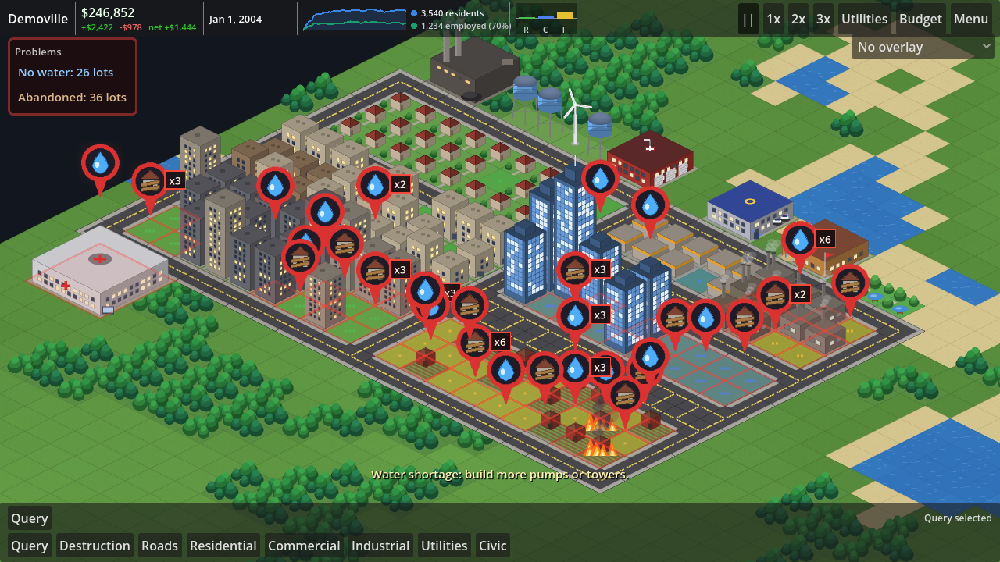
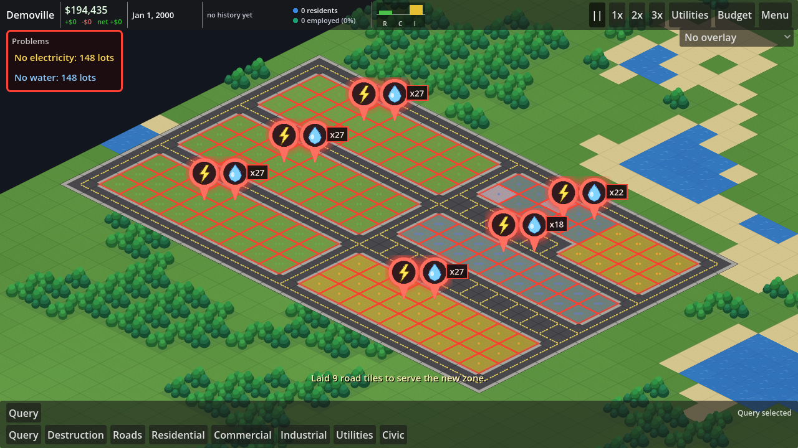
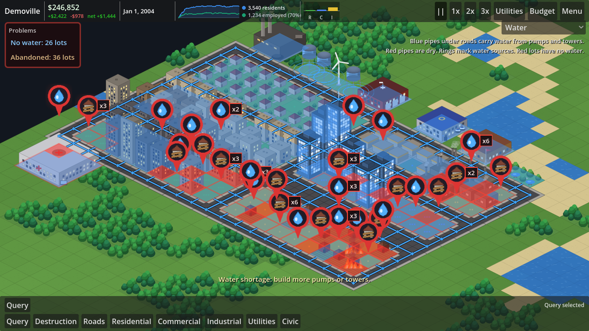
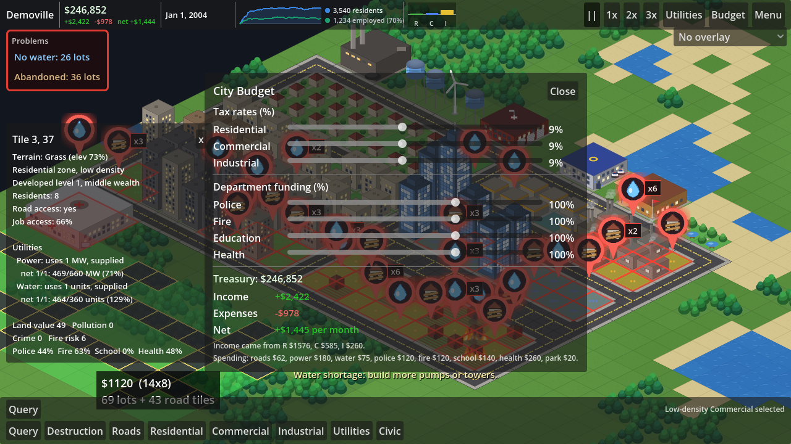

# City Sim

An isometric city-building simulation game built with **Godot 4.7** and GDScript, in the
spirit of SimCity 4. Lay roads, zone land for residents, shops and factories, keep the
lights on and the taps running, fund police, fire, schools and hospitals, and try to keep
the treasury in the black while the city grows.

All sprites are generated by a script in this repository (`tools/generate_sprites.py`), so
the project has no third-party art and opens and runs from a plain checkout.









## Running the game

1. Install [Godot 4.7](https://godotengine.org/download) (the standard build; .NET is not needed).
2. Open the Godot project manager, choose **Import**, and select `project.godot` in this folder.
3. Press **F5** (Run Project). The main menu lets you name your city, pick a map size and
   seed, and decide whether random disasters are enabled (off by default).

From the command line:

```sh
godot --path /path/to/city-sim
```

## How to play

| Action | Control |
| --- | --- |
| Pan the camera | `W A S D` / arrow keys, or drag with middle or right mouse button |
| Zoom | Mouse wheel |
| Place zones / bulldoze | Pick a tool, then left-click-drag a rectangle |
| Lay roads | Pick Road, then left-click-drag (an L-shaped path is previewed) |
| Place a building | Pick it from Utilities or Civic, then left-click |
| Inspect a tile | Query tool (or no tool) and left-click |
| Power and water graphs | Utilities button in the top bar |
| Residents vs employed | Graph in the top bar |
| Cancel tool / close panel | Right-click or `Esc` |
| Pause / speed | `Space`, `1`, `2`, `3`, or the buttons in the top bar |
| Shortcuts | `R` road, `B` bulldoze, `Q` query |

### Getting a city started

1. Lay a few roads, or just start zoning: the zone tool lays whatever service roads a
   district needs and shows them in the drag preview before you commit.
2. Build a power source (a wind turbine is cheap) and a water tower or a water pump next to
   water. Power and water travel under roads and through any built tile, so keep things
   connected. The Power and Water overlays draw the wires and pipes so you can see exactly
   where supply reaches and where it stops.
3. Zone residential, commercial and industrial land next to the roads. Watch the RCI gauge in
   the top bar: bars above the line mean demand, bars below mean oversupply.
4. Open **Budget** to set tax rates and department funding. Nine percent is the neutral
   tax rate; higher rates cut demand. The top bar shows the treasury with last month's
   income, expenses and net underneath it.
5. Open **Utilities** for power and water utilisation: a headline reading and meter for
   each, plus a chart of the last ten years. Hover a chart for the figures in any month.
   Power and water are drawn as two charts rather than one, because they are different
   units and a shared y-axis would misrepresent both.
6. Add parks, schools, police and fire stations as the city grows. Use the overlay dropdown
   (top right) to see power, water, land value, pollution, crime, traffic, fire risk and
   service coverage.

### When a zone does nothing

A lot that is zoned but has no electricity, no water or no road will never develop, so the
game says so loudly instead of leaving you guessing:

- Every affected lot gets a **pulsing red outline**, so you can see how far the problem spreads.
- A **flashing alert badge** floats above each contiguous block, one per problem: a yellow
  bolt for no electricity, a blue drop for no water, a crossed-out road for no road access.
  A badge covering more than one lot carries a count, such as `x27`.
- A **Problems banner** in the top-left lists the totals. Click a line to jump the camera to
  an affected lot; click again to tour the rest.

A lot that developed and then lost its building is marked **abandoned**, with its own
boarded-up-house badge and a line in the banner, so a city going backwards is visible
rather than just showing up as a falling population.

Utility and civic buildings raise the same warnings when they lack what they need, including
a water pump built away from water. Road access takes priority: while a lot has no road, that
is the only warning it shows, because power and water travel along roads anyway.

## Zoning and block sizes

Dragging a zone does not fail when the lots are out of reach of a road. The game works out
the service roads the district needs, shows them in the preview with the cost, and lays them
when you release. New roads are linked back to the existing network so the district is not
an island.

Each zone has a maximum block size, and roads are inserted to respect it:

| Zone | Largest block | Reaches from a road |
| --- | --- | --- |
| Residential | 4 tiles deep | 2 tiles |
| Commercial | 2 x 5 tiles | 2 tiles |
| Agricultural (low-density industrial) | 8 tiles deep | 4 tiles |
| Medium and high industrial | 4 tiles deep | 2 tiles |

Low-density industrial is farmland: it grows fields with a barn and silo rather than sheds,
and it needs room, so it sits further from a road than a city block does.

## Simulation overview

Every simulated month the following systems run in order (see `scripts/sim/simulation.gd`):

- **Alerts** – `scripts/sim/alerts.gd` turns the service maps into per-tile warning flags
  and totals, which drive both the in-world badges and the HUD banner.
- **Road network** – flood-fills road components, marks which lots have road access (each
  zone has its own reach, so farmland counts at four tiles where a city block counts at
  two), and estimates job accessibility for residents. Traffic spreads along roads.
- **Utilities** – power and water propagate from plants through connected built tiles. If a
  network's demand exceeds supply, tiles furthest from the source lose service first. Each
  separately connected grid is tracked on its own, so the Query tool can report the local
  network rather than only the city-wide total.
- **Services** – police, fire, school, hospital and park coverage radiate from each building,
  scaled by its department funding. Unpowered services run at reduced strength.
- **Environment** – pollution (industry, coal, traffic, fires), crime (density, poverty,
  unemployment, minus police), land value (water, elevation, parks, services, minus
  pollution/crime/industry) and fire risk.
- **Demand** – residential demand follows available jobs, commercial follows population,
  industrial has external demand so a new town can bootstrap. Taxes and brownouts reduce it.
- **Growth** – zoned lots with a road, power, water and positive demand develop and level up.
  Higher levels need better land value; wealth follows land value. Unserved lots decay.
- **Fire and disasters** – fires spread to flammable neighbours and burn out into rubble
  unless fire coverage extinguishes them. With random disasters enabled, tornadoes, meteors
  and major fires may strike; all three can also be triggered from the in-game menu.
- **Budget** – tax income from developed lots minus building upkeep and department funding.

## Graphics

The isometric tile is 128 x 64 pixels. Every sprite lives in `assets/sprites/` as a PNG whose
footprint diamond is flush with the bottom edge, so a sprite with an `s x s` footprint is
`128 * s` pixels wide and as tall as the building needs. `tools/generate_sprites.py`
(standard library only) draws all of them: terrain variants, 16 road connection pieces,
zone lots, 27 building variants per zone type (density x level x wealth), the civic
buildings, rubble, fire, smoke and the alert badges (a resting and a brighter "hot" frame
per problem, cross-faded at runtime to make them flash). Edit the generator and re-run it to
change the look of the game:

```sh
python3 tools/generate_sprites.py
```

## Window size

The project stretches its canvas to fill the window, so resizing scales the interface and
shows more of the map rather than cropping it. The layout is designed against a 1280x720
base and has been checked from 1000x760 up to 1680x820.

## Project layout

```
project.godot            Godot project (autoloads, display settings)
assets/sprites/          Generated PNG sprites (see Graphics)
tools/generate_sprites.py  Sprite generator
scenes/
  main_menu.tscn         Title screen
  game.tscn              Game scene: render layers, camera, HUD
scripts/
  autoload/              Events (signal bus), GameState (city data), SaveManager (JSON saves)
  core/                  Constants, BuildingDefs catalogue, CityGrid data model, TerrainGenerator
  sim/                   One file per simulation system plus the Simulation orchestrator
  game/                  GameController (input, clock) and BuildTools (applying tools)
  render/                IsoMath, Sprites loader, chunked terrain/world/overlay layers,
                         alerts, cursor, camera
  ui/                    HUD, RCI gauge, population graph, info panel, budget panel,
                         utilities panel and charts, in-game menu, main menu
tests/                   Headless smoke tests (see below)
```

Saves are written to `user://saves/<name>.json` (on Linux this is
`~/.local/share/godot/app_userdata/City Sim/saves/`).

## Tests

Two headless smoke tests exercise the simulation and the scene code without a display:

```sh
godot --headless --path . --import          # first run only: builds the class cache
godot --headless --path . tests/sim_smoke_test.tscn
godot --headless --path . tests/scene_smoke_test.tscn
```

Both exit with code 0 on success and print `ALL ... CHECKS PASSED`.

`tests/screenshot_capture.tscn` builds a demo town and saves screenshots; it needs a display
(or `xvfb-run`) because it renders for real:

```sh
xvfb-run -a godot --path . --resolution 1280x720 tests/screenshot_capture.tscn -- --out=/tmp/shots
```

## Ideas for what comes next

- Region view with multiple connected cities
- Bridges, highways, rail and mass transit
- Advisors, charts and a proper news ticker history
- Terrain tools (raise, lower, plant trees) and real building sprites
